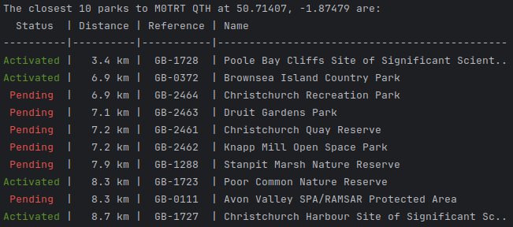

# POTA Local Parks Progress

POTA Local Parks Progress is a simple Python script that queries the Parks on the Air API to find your closest parks,
prints them in a list starting from the closest, and includes the status of whether you have activated them yet or not.
The output looks like this:

<p align="center">
  
</p>

## What?

[Parks on the Air](https://parksontheair.com/) is an Amateur Radio activity where radio operators set up portable
stations in country parks, nature reserves, etc. to enjoy the great outdoors alongside their hobby.

There is a set list of parks world-wide which count for the program, which is regularly updated to include new locations
by a team of volunteers.

"Activating" a park consists of going there, setting up a portable radio station, and making at least 10 contacts with
other radio stations around the world, following the [POTA Rules](https://docs.pota.app/docs/rules.html).

This software helps POTA activators keep track of their progress through their local parks, find the closest park they
haven't activated yet, etc.

## Usage

Usage with `venv` and `pip` on Linux is recommended, but it will work fine wherever you use Python and however you like
to manage it.

A complete example for Debian & derivatives such as Ubuntu is shown below:

```bash
sudo apt install python3 python3-pip python3-venv
git clone https://github.com/ianrenton/pota-local-progress.git
cd pota-local-progress
python3 -m venv .venv
source .venv/bin/activate
pip install -r requirements.txt
python3 pota_local_progress.py <num_parks> <callsign> [ <lat> <lon> | <grid> ]
deactivate
```

On the line where the script runs:

```bash
python3 pota_local_progress.py <num_parks> <callsign> <lat> <lon>
```

or:

```bash
python3 pota_local_progress.py <num_parks> <callsign> <grid>
```

You will need to set the three/four command-line arguments appropriately for your query. `num_parks` tells the script to
consider this number of parks closest to you. `lat` and `lon` are in decimal degrees, positive East and South, for your
home location. Alternativitly, `<grid>` is your Maidenhead Grid location. So I might for example run:

```bash
python3 pota_local_progress.py 20 M0TRT 50.71407 -1.87479
```

or:

```bash
python3 pota_local_progress.py 20 M0TRT IO90br
```

> [!WARNING]
> Always do your own research to find out if it is possible and legal to activate a park, regardless of whether it appears
> within this software or on the POTA website, and abide by the POTA rules.
>
> This software makes a number of queries to the "public but unofficial" POTA API. It caches the result for one day, to
> avoid overloading the servers with repeated requests. Please do not abuse the API by hammering it with an undue number
> of requests.